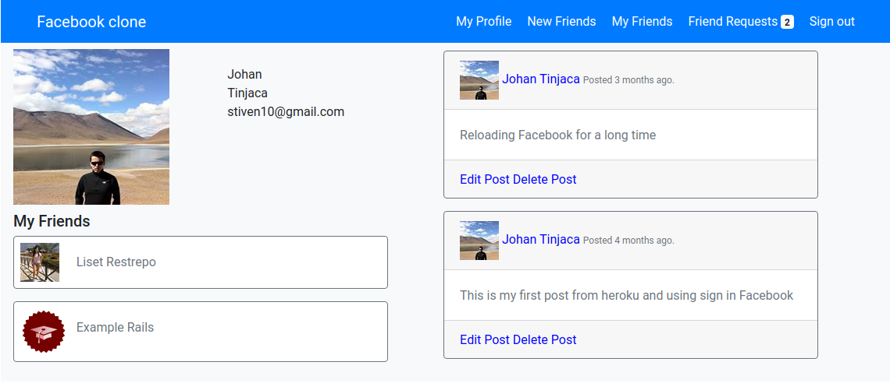

# Project: Building Facebook
This project is about building a large portion of the core Facebook user functionality. You can check the complete description [here](https://www.theodinproject.com/courses/ruby-on-rails/lessons/final-project#project-building-facebook)

## Screenshot


## Live Demo:
Check a live version on Heroku. [here](https://intense-reaches-58174.herokuapp.com/)

## Built With:
ruby 2.6.3, rails 5.2.3


## Getting started

To get started with the app, clone the repo and then install the needed gems:

```
$ bundle install --without production
```

Next, migrate the database:

```
$ rails db:migrate
```

Finally, run the test suite to verify that everything is working correctly:

```
$ rspec
```

If the test suite passes, you'll be ready to run the app in a local server:

```
$ rails server
```


## Usage

Go to localhost in your favorite browser
```
http://localhost:3000/
```

## Automated Tests
Get in to the folder app and run

```
rspec
```

## Upcoming Features

To see the upcoming features check the [issues page](https://github.com/jstiven01/facebook-clone/issues)

## Author

👤 **Johan Stiven Tinjacá Tocora**

- Github: [@jstiven01](https://github.com/jstiven01)
- Email: [stiven10@gmail.com](mailto:stiven10@gmail.com)
- Twitter: [@TinjacaJohan](https://twitter.com/TinjacaJohan)
- Linkedin: [Johan Tinjacá](https://www.linkedin.com/in/johanstiventinjaca/)

